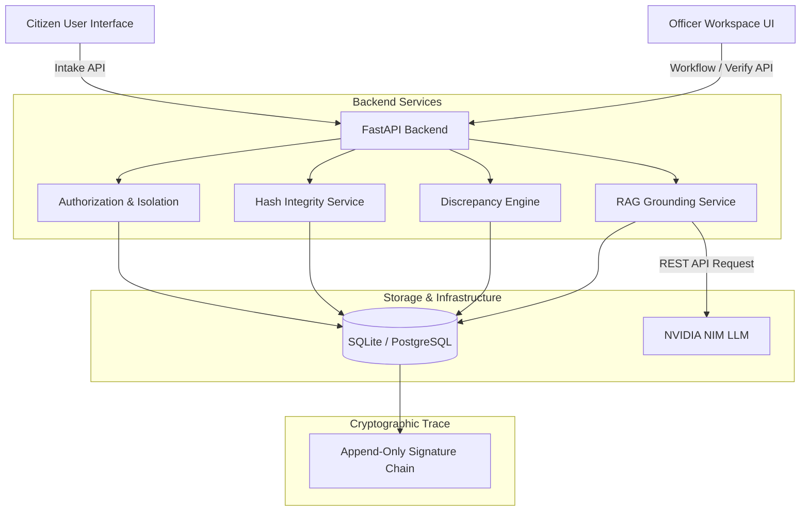

# BhoomiFlow

An evidence-first land-record workflow and verification assistant designed to help citizens and government officers trace land case document timelines, map physical ownership relationships, detect verification conflicts, and consult grounded procedural guidance.

---

## 1. Problem Statement & Positioning
In land administration, citizens and revenue officers face fragmented, offline, and complex paperwork. Tracing mutation histories, checking spelling discrepancies across legacy records, identifying missing documents, and verifying procedural rules presents a high administrative burden. 

**BhoomiFlow** addresses this by projecting a structured timeline, a case relationship graph, and automated conflict warnings. 
* **What it does**: Provides a traceability and verification assistance system for case review.
* **What it does NOT do**: BhoomiFlow does *not* make final legal decisions, legally declare land ownership, authenticate documents officially, or replace the authority of revenue officers. It is designed strictly as a **Human-in-the-Loop decision assistant**.

---

## 2. Core Capabilities

| Feature Area | Sub-feature | Description |
|---|---|---|
| **Case Workflow** | Citizen Intake | Multi-step authenticated case creation with land parcel, survey number, and heir details. |
| | Officer Assignment | Regional routing matching cases to officer jurisdictions (Taluka/District level). |
| | Case Isolation | Strict row-level security ensuring citizens only access their own cases and officers only see assigned tasks. |
| **Evidence & Integrity**| SHA-256 Hashing | Automatically hashes all uploaded files on the server to establish an immutable document identity. |
| | Audit Timeline | Every state transition and attachment triggers a cryptographic append-only event signature chain. |
| **Case Graph** | Entity Projections | Projects relationships between Persons (heirs, buyers), Land Parcels, Documents, and Events. |
| **Conflict Engine** | Discrepancy Warnings | Compares documents to flag survey number mismatches, name variations, date contradictions, and missing official counterparts. |
| | Resolution Workflow | Officers can mark discrepancies as "Reviewed" or "Dismissed" with auditable timeline notes. |
| **Grounded Guidance (RAG)**| Knowledge Ingestion | Ingests official government land codes and SOPs (such as the Maharashtra Land Revenue Code, 1966) into indexed tables. |
| | NVIDIA NIM Grounding | Uses NVIDIA NIM API for grounded RAG synthesis. Restricts explanations strictly to source documents. |
| | Traceable Citations | Automatically includes authoritative source department names, dates, and official URLs. |
| **Multilingual** | Translation | Localized user interface and language toggle supporting English, हिंदी (Hindi), and मराठी (Marathi) with context persistence. |

---

## 3. System Architecture



---

## 4. Grounded RAG Dataflow

```
   Official Government SOPs (Dataset 4)
                  ↓
          KnowledgeSource Table
                  ↓
          KnowledgeChunk Table
                  ↓
      Case Context + User Query
                  ↓
    Term-matching Keyword Retrieval
                  ↓
         NVIDIA NIM Generation
                  ↓
    Grounded Response + Citations
```

---

## 5. Dataset Architecture & Strict Data Integrity

BhoomiFlow operates with four separate datasets for evaluation, training, and operational knowledge. 

```
  Dataset 1 (Synthetic Cases)  ──> Loader  ──> Case Reasoning Evaluation (Isolated)
  Dataset 2 (Extraction Data) ──> Parser  ──> Rule Extraction Benchmarking (Isolated)
  Dataset 3 (Comparison Data) ──> Engine  ──> Discrepancy Rule Benchmarking (Isolated)
  Dataset 4 (Gov Procedures)   ──> Ingester ──> KnowledgeSource & KnowledgeChunk Tables
```

### Strict Data Integrity Rule
> [!IMPORTANT]
> * **Dataset 1, 2, and 3** are strictly for evaluation and testing. **ZERO** synthetic cases, documents, evidence, user profiles, or timeline entries from these datasets are permitted to enter production PostgreSQL tables.
> * **Dataset 4** contains authoritative government procedures and is ingested strictly into `KnowledgeSource` and `KnowledgeChunk` tables to power RAG. It never creates cases, documents, or citizen profiles.

---

## 6. Directory Structure
```
bhoomiflow/
├── frontend/             # React + Tailwind CSS Web Application
├── backend/              # FastAPI Application Core
│   ├── app/              # Database models, routers, and business logic services
│   ├── datasets/         # Evaluation corpora (Datasets 1, 2, 3, and 4)
│   ├── evaluation/       # Python benchmark validation modules
│   ├── migrations/       # Alembic database migrations scripts
│   └── tests/            # Pytest test cases
└── README.md
```

---

## 7. Setup & Local Development

### Prerequisites
* Python 3.10+
* Node.js 18+

### Backend Setup
1. Navigate to the backend directory:
   ```bash
   cd backend
   ```
2. Install Python dependencies:
   ```bash
   pip install -r requirements.txt
   ```
3. Run Alembic migrations:
   ```bash
   alembic upgrade head
   ```
4. Start the FastAPI server:
   ```bash
   uvicorn app.main:app --reload
   ```

### Frontend Setup
1. Navigate to the frontend directory:
   ```bash
   cd ../frontend
   ```
2. Install Node modules:
   ```bash
   npm install
   ```
3. Build the frontend:
   ```bash
   npm run build
   ```
4. Start the development server:
   ```bash
   npm run dev
   ```

### Running Tests
```bash
pytest
```

---

## 8. E2E Acceptance Testing (Judge Demo Path)
For the complete Standard Operating Procedure (SOP) and synthetic testing materials, see **[sop/SOP.md](file:///c:/Users/athar/OneDrive/Documents/projects/BhommiFlow/sop/SOP.md)**.

---

## 8. Responsible AI & Safety Boundaries
* **Verification over Generation**: NVIDIA NIM answers are bounded strictly to the retrieved government corpus. If no matching knowledge exists, the system outputs: *"No relevant government guidance is currently available."*
* **Anti-Hallucination**: No model output can override metadata extracted via deterministic regex patterns or modify land records.
* **No Automated Legal Adjudication**: BhoomiFlow highlights discrepancies but does not verify the legality of a land title. Officers must sign off manually on every status update.

---

## 9. Development & AI-Assisted Engineering
* AI-assisted programming tools were utilized strictly as offline engineering aids for implementation planning, refactoring assistance, code exploration, and test case generation.
* **OpenAI and Codex are NOT runtime dependencies** of the BhoomiFlow application. The server executes entirely on Python, FastAPI, and direct NVIDIA NIM API requests.
